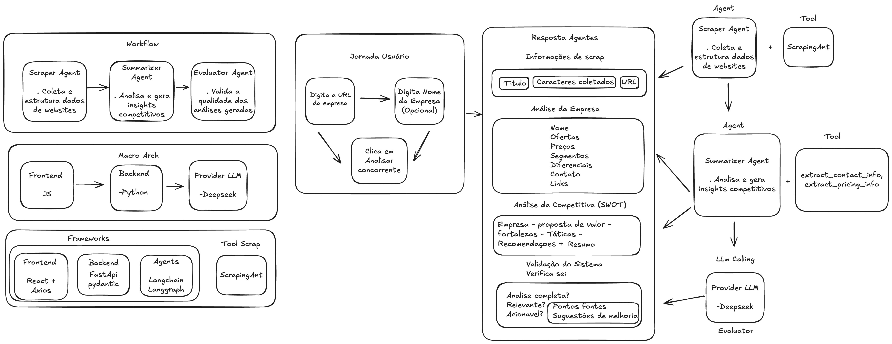
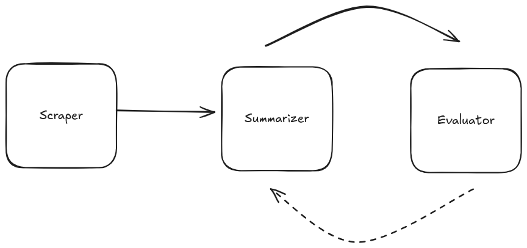
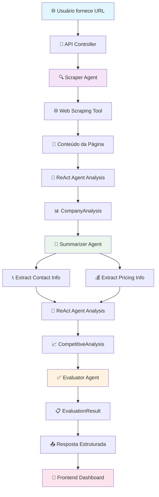
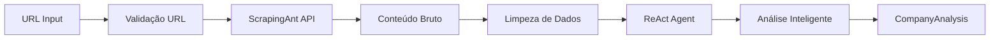
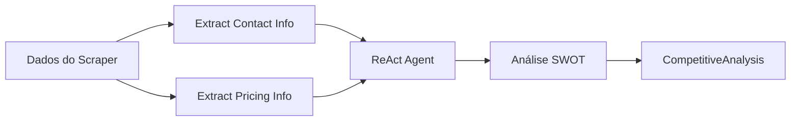
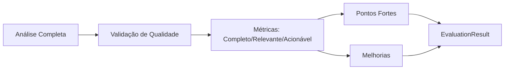

# Sistema de Análise de Concorrentes


# Diagrama de arquitetura



# Evaluator Porpose


Sistema inteligente para análise competitiva utilizando agentes de IA especializados. O projeto combina web scraping, processamento de linguagem natural e análise estratégica para fornecer insights detalhados sobre concorrentes.

## 🏗️ Arquitetura

O sistema segue uma arquitetura de **agentes especializados** com design pattern **Evaluator**, onde cada agente tem uma responsabilidade específica e trabalha em conjunto para produzir análises competitivas completas.

### Design Pattern: Evaluator
- **Scraper Agent**: Coleta e estrutura dados de websites
- **Summarizer Agent**: Analisa e gera insights competitivos
- **Evaluator Agent**: Valida a qualidade das análises geradas

## 🚀 Funcionalidades

### Backend (FastAPI)
- **Web Scraping Inteligente**: Coleta dados de websites usando ScrapingAnt
- **Análise Competitiva**: Gera análises SWOT e insights estratégicos
- **Validação de Qualidade**: Sistema de avaliação automática das análises
- **API RESTful**: Endpoints para integração com frontend

### Frontend (React)
- **Interface Intuitiva**: Dashboard para análise de concorrentes
- **Visualização de Dados**: Apresentação estruturada dos resultados
- **Status em Tempo Real**: Monitoramento do status dos agentes
- **Design Responsivo**: Interface moderna e responsiva

## 🤖 Agentes do Sistema

### 1. Scraper Agent
**Responsabilidade**: Coleta e estruturação de dados de websites

**Funcionalidades**:
- Web scraping usando ScrapingAnt (com proxy e renderização JS)
- Extração de informações estruturadas (nome, ofertas, preços, segmentos)
- Análise inteligente usando ReAct Agent (LangGraph)
- Tratamento de erros e validação de URLs

**Dados Extraídos**:
- Nome da empresa
- Produtos/serviços oferecidos
- Informações de preços
- Segmentos de mercado
- Diferenciais competitivos
- Informações de contato
- Links relevantes

### 2. Summarizer Agent
**Responsabilidade**: Análise competitiva e geração de insights

**Funcionalidades**:
- Análise SWOT (Fortalezas, Ameaças, Oportunidades)
- Extração de dados específicos (contatos, preços)
- Geração de recomendações estratégicas
- Análise de proposta de valor

**Tools Especializadas**:
- `extract_contact_info`: Extrai telefones e URLs
- `extract_pricing_info`: Identifica informações de preços
- ReAct Agent para análise contextual

### 3. Evaluator Agent
**Responsabilidade**: Validação da qualidade das análises

**Funcionalidades**:
- Avaliação de completude da análise
- Verificação de relevância
- Validação de acionabilidade
- Identificação de pontos fortes e melhorias

**Métricas de Qualidade**:
- `completo`: A análise cobre os pontos-chave?
- `relevante`: A análise é relevante para a tarefa?
- `acionavel`: Traz recomendações práticas?

## 📡 Endpoints da API

### `POST /api/v1/quick-analysis`
Análise rápida e completa de um concorrente.

**Request**:
```json
{
  "url": "https://exemplo.com",
  "company_name": "Nome da Empresa (opcional)"
}
```

**Response**:
```json
{
  "success": true,
  "url": "https://exemplo.com",
  "scrape": {
    "title": "Título da página",
    "chars": 5000
  },
  "data": {
    "name": "Nome da empresa",
    "offerings": ["produto1", "produto2"],
    "pricing": "Informações de preços",
    "segments": ["segmento1", "segmento2"],
    "differentiators": ["diferencial1", "diferencial2"],
    "contact": "info de contato",
    "links": ["link1", "link2"]
  },
  "analysis": {
    "empresa": "Nome da empresa",
    "proposta_valor": "Proposta de valor",
    "fortalezas": ["fortaleza1", "fortaleza2"],
    "ameacas": ["ameaça1", "ameaça2"],
    "oportunidades": ["oportunidade1", "oportunidade2"],
    "taticas": {"precos": "info preços", "contatos": "info contatos"},
    "recomendacoes": ["recomendação1", "recomendação2"]
  },
  "summary": "Resumo executivo da análise",
  "validation": {
    "completo": true,
    "relevante": true,
    "acionavel": true,
    "pontos_fortes": ["ponto1", "ponto2"],
    "melhorias": ["melhoria1", "melhoria2"]
  },
  "timestamp": "2024-01-01T12:00:00"
}
```

### `GET /api/v1/health`
Verificação de saúde da API e status dos agentes.

## 🛠️ Tecnologias Utilizadas

### Backend
- **FastAPI**: Framework web moderno e rápido
- **LangChain**: Framework para aplicações com LLM
- **LangGraph**: Criação de agentes ReAct
- **ScrapingAnt**: Serviço de web scraping
- **DeepSeek**: Provedor de LLM
- **Pydantic**: Validação de dados
- **Uvicorn**: Servidor ASGI

### Frontend
- **React 18**: Biblioteca para interfaces de usuário
- **Axios**: Cliente HTTP
- **Lucide React**: Ícones modernos
- **CSS Modules**: Estilização modular

## 📦 Instalação e Execução

### Pré-requisitos
- Python 3.8+
- Node.js 16+
- Chaves de API (DeepSeek e ScrapingAnt)

### 1. Configuração do Backend

```bash
# Navegar para o diretório do backend
cd competitor_analysis/backend

# Instalar dependências
uv sync

# Configurar variáveis de ambiente
cp .env.example .env
# Editar .env com suas chaves de API:
# DEEPSEEK_API_KEY=sua_chave_deepseek
# SCRAPINGANT_API_KEY=sua_chave_scrapingant

# Executar aplicação
uv run python app/main.py
```

### 2. Configuração do Frontend

```bash
# Navegar para o diretório do frontend
cd frontend

# Instalar dependências
npm install

# Executar aplicação
npm start
```

### 3. Acessar a Aplicação
- **Frontend**: http://localhost:3000
- **Backend API**: http://localhost:8000
- **Documentação da API**: http://localhost:8000/docs

## 🔧 Configuração

### Variáveis de Ambiente (.env)
```env
# DeepSeek API
DEEPSEEK_API_KEY=sua_chave_aqui

# ScrapingAnt API
SCRAPINGANT_API_KEY=sua_chave_aqui

# Configurações do servidor
HOST=0.0.0.0
PORT=8000
DEBUG=True
```

## 📊 Fluxo de Análise Completo

### Diagrama de Fluxo dos Agentes



### Fluxo Detalhado por Etapa

1. **🌐 Input**: Usuário fornece URL e nome da empresa (opcional)
2. **🔍 Scraper Agent**: 
   - Valida URL
   - Executa web scraping com ScrapingAnt
   - Usa ReAct Agent para análise inteligente
   - Extrai dados estruturados (CompanyAnalysis)
3. **📝 Summarizer Agent**:
   - Recebe dados do Scraper
   - Extrai contatos e preços com tools especializadas
   - Gera análise SWOT e insights estratégicos
   - Cria recomendações acionáveis
4. **✅ Evaluator Agent**:
   - Valida qualidade da análise
   - Verifica completude, relevância e acionabilidade
   - Identifica pontos fortes e melhorias
5. **📤 Output**: Resultado estruturado com insights e recomendações

### 🔄 Fluxo Interno Detalhado dos Agentes

#### 🔍 Scraper Agent - Processo Interno


**Ferramentas**:
- `web_scraping_tool`: Coleta dados com ScrapingAnt
- **ReAct Agent**: Análise contextual do conteúdo
- **Limitação**: 12k → 5k caracteres para otimização

#### 📝 Summarizer Agent - Processo Interno


**Ferramentas Especializadas**:
- `extract_contact_info`: Telefones e URLs (phonenumbers)
- `extract_pricing_info`: Preços estruturados (price_parser)
- **Processamento de Tokens**: 500 palavras para eficiência
- **Limitação**: 25 preços máximos

#### ✅ Evaluator Agent - Processo Interno


**Métricas de Qualidade**:
- **Completo**: Cobre pontos-chave?
- **Relevante**: É relevante para a tarefa?
- **Acionável**: Traz recomendações práticas?

### 🎯 Design Pattern: Evaluator

O sistema implementa o **Design Pattern Evaluator** onde:

1. **Scraper** = **Coletor de Dados**
2. **Summarizer** = **Gerador de Conteúdo** 
3. **Evaluator** = **Validador de Qualidade**

**Vantagens**:
- ✅ **Separação de Responsabilidades**: Cada agente tem função específica
- ✅ **Qualidade Garantida**: Validação automática das análises
- ✅ **Escalabilidade**: Fácil adicionar novos agentes
- ✅ **Manutenibilidade**: Código modular e testável

## 🎯 Casos de Uso

- **Análise de Concorrentes**: Entender posicionamento e estratégias
- **Inteligência de Mercado**: Identificar oportunidades e ameaças
- **Benchmarking**: Comparar ofertas e diferenciais
- **Pesquisa de Mercado**: Coletar dados estruturados de websites


## 📈 Próximos Passos

### 🔧 Melhorias no Design Pattern Evaluator
- [ ] **Implementar correção automática**: Sistema deve refinar análises baseado na crítica do Evaluator
- [ ] **Loop de melhoria**: Quando avaliação é negativa, reenviar para Summarizer com feedback específico
- [ ] **Múltiplos provedores LLM**: Adicionar OpenAI/Anthropic no Evaluator para maior robustez
- [ ] **Análise comparativa**: Comparar concorrente com empresa do cliente
- [ ] **Benchmarking automático**: Identificar gaps e oportunidades competitivas


